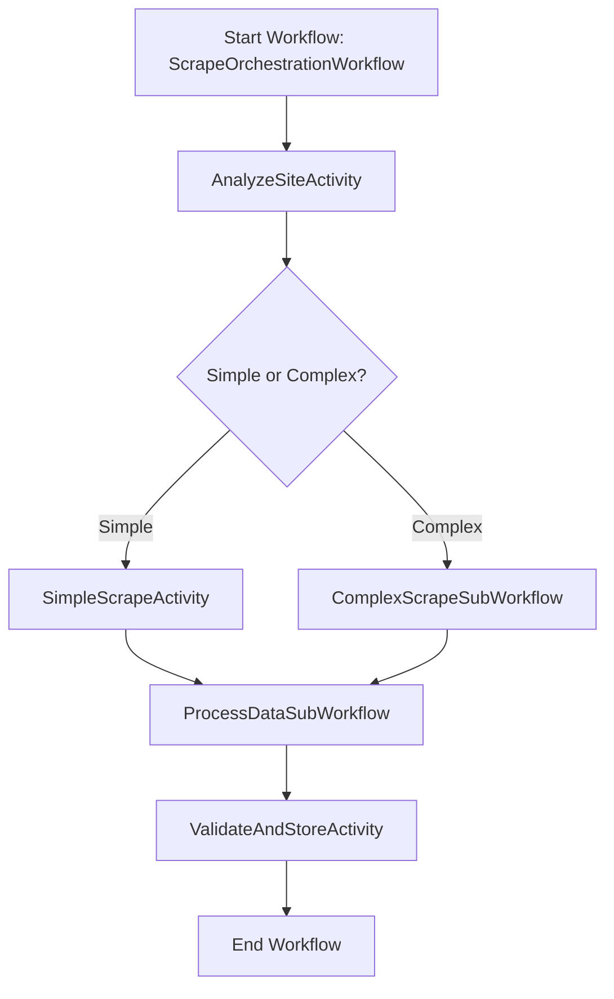

flask fab create-admin

flask db init

flask db migrate

flask db upgrade

Below is a **condensed plan** that combines the essential components of a flexible scraping system into a smaller set of “agents” (or modules)—with **Temporal** orchestrating the entire flow.:

---

# Overall Architectural Outline

1. **Agent A: Orchestration & Workflow (Temporal)**
2. **Agent B: Website Analysis & Scraping Strategy**
3. **Agent C: Proxy & IP Management**
4. **Agent D: Scraping Worker**
5. **Agent E: Data Processing & LLM Summarization**
6. **Agent F: Validation, DB Ingestion & Monitoring**

The idea is to let **Temporal** handle:
- State management  
- Task scheduling & synchronization  
- Retries, error handling, backoff  
- Branching logic (simple vs. complex site flows)

Each “agent” can be deployed as a microservice or as modular code within a single service—whatever best fits your environment.

---

## Agent A: Orchestration & Workflow (Temporal)

**Role**: This is the “nerve center.” It coordinates **all** activities:
1. **Invoke website analysis** to decide if a site is simple or complex.
2. **Choose** between simple scraping flow or complex (login, captcha, IP rotation).
3. **Parallelize** or sequence tasks (downloading pages, processing data, etc.).
4. **Handle errors** automatically (retry with different proxies, new user credentials, etc.).
5. **Control the entire pipeline** from analysis → scraping → data processing → validation → DB storage.

**How it works**:
- You create a **Workflow** in Temporal (e.g., `ScrapeOrchestrationWorkflow`).
- The workflow spawns **Activities** (small tasks) or **Sub-workflows** for each step (login, page fetch, data parse, etc.).
- If something fails (e.g., a captcha breaks, an IP is banned), Temporal automatically retries or triggers fallback logic.

---

## Agent B: Website Analysis & Scraping Strategy

**Role**: Determines how to scrape each site.  
1. **Analyze site** for signs of:
   - Required authentication  
   - Captcha presence  
   - Rate limits / IP bans  
   - HTML vs. JavaScript-heavy pages
2. **Output** a “complexity level” plus any special instructions (e.g., “login first,” “use captcha solver”).

**Implementation Detail**:
- This can be an **Activity** in the Temporal workflow, returning a structured result like:
  ```json
  {
    "needsLogin": true,
    "captchaLikely": false,
    "complexityLevel": "HIGH"
  }
  ```
- The workflow uses this info to decide how many advanced steps (login, captcha solving, proxy rotation) to enable.

---

## Agent C: Proxy & IP Management

**Role**: Manages IP rotation and tracks site-specific blocking or suspicious patterns.  
1. **Maintain a pool of proxies** (residential, datacenter, mobile).
2. **Rotate proxies** on each request or after a certain threshold of requests/time.
3. **Monitor error codes** (403, 429, captchas) and automatically switch to new IPs if bans or rate limits occur.
4. **Integration with Orchestrator**: The Orchestrator can call “getProxy” from this agent each time it needs to fetch a page.

**Implementation Detail**:
- Could be a **microservice** or library.  
- Exposed as an **Activity** in Temporal, e.g.:
  ```python
  def get_next_proxy(site_id) -> str:
      # returns a healthy proxy for that site
  ```

---

## Agent D: Scraping Worker

**Role**: Actually performs the page requests and (if needed) interacts with forms or headless browsers.  
1. **Handles login flows**: Use stored credentials or cookies.
2. **Solves captchas** (either via a third-party API or an internal AI model) if “captchaLikely” is detected.
3. **Fetches pages** from the site using the selected proxy/IP.
4. **Returns raw HTML**, JSON, or screenshot data to the Orchestrator.

**Implementation Detail**:
- If site is simple: it just does a normal HTTP GET (with or without headless).  
- If site is complex: it launches a headless browser (Puppeteer, Playwright, etc.) to simulate real user actions and solve interactive challenges.  
- Each “fetch page” call can be an **Activity** invoked by the Temporal workflow:
  ```python
  def fetch_page(url: str, proxy: str, login_session: Optional[str]) -> str:
      # returns raw HTML
  ```

---

## Agent E: Data Processing & LLM Summarization

**Role**: Turns raw data into structured text, optionally runs an LLM to parse or summarize.  
1. **Convert** HTML/PDF/images to clean text or structured data (pull out relevant elements).
2. **LLM Summaries**: If needed, call a summarization/extraction prompt. For example, “Given this raw text, extract product details (price, name, etc.) and generate a summary.”
3. **Return** the processed/summarized output to the Orchestrator.

**Implementation Detail**:
- This can be a **Sub-workflow** or a set of **Activities**:
  - `extract_raw_text(raw_html)`
  - `run_llm_summarization(clean_text)`
- If the site only needs the raw data (no summarization), you skip the LLM step.

---

## Agent F: Validation, DB Ingestion & Monitoring

**Role**: Final checks, storing data, and system health.  
1. **Validate** the structured data (check if it’s non-empty, matches expected schema, etc.).
2. **Store** data in the database:
   - Could be a SQL DB, NoSQL, or data lake depending on your needs.
3. **Monitoring & Anomaly Detection**:
   - Tracks success/failure rates (scraping attempts, captcha solves, IP blocks).
   - Sends alerts if it detects a spike in failures or suspicious patterns.

**Implementation Detail**:
- Validation + DB insertion can be a single **Activity** or sub-workflow step, e.g.:
  ```python
  def validate_and_store(data):
      # do checks
      # if ok, insert into DB
      # if not ok, raise exception or signal for a human review
  ```
- **Monitoring** can be partially handled by Temporal’s built-in metrics/logging and partially by external tools (e.g. Prometheus, Datadog, custom dashboards).

---

# Example Temporal Flow

Below is a simplified example workflow in pseudocode:



1. **Start Workflow**: Triggered by an external event or a schedule (e.g., every hour).
2. **AnalyzeSiteActivity** (Agent B):
   - Returns complexity info & site requirements.
3. **Branch**:
   - If **simple** → **SimpleScrapeActivity** (Agent D): direct HTTP GET, minimal overhead.
   - If **complex** → **ComplexScrapeSubWorkflow** (Agent D + Agent C):
     1. Login (if needed)  
     2. Solve captcha (if needed)  
     3. Use rotating proxies  
     4. Fetch data
4. **ProcessDataSubWorkflow** (Agent E):
   - Convert raw HTML to text  
   - (Optional) Summarize/extract with LLM  
   - Return structured output
5. **ValidateAndStoreActivity** (Agent F):
   - Check data quality  
   - Insert into DB  
   - Gather metrics (success/failure rates)
6. **End Workflow**: Mark as complete (Temporal tracks success/failure).  
7. **Monitoring** (Agent F, behind the scenes):
   - Runs continuously in parallel or uses logs from Temporal for anomaly detection or alerts.

---

# Putting It All Together

1. **User or Cron** triggers `ScrapeOrchestrationWorkflow`.
2. **Website Analysis** (Agent B) determines if advanced measures (captcha solving, logins, or proxies) are needed.
3. **Temporal** then orchestrates the actual scraping path—“SimpleScrape” or “ComplexScrape.”
4. **Proxy Management** (Agent C) is called only when needed—especially if the site is flagged “complex.”
5. **Scraping Worker** (Agent D) returns raw data, handling captchas/logins as necessary.
6. **Data Processing & Summarization** (Agent E) cleans, parses, or runs LLM-based extraction.
7. **Validation & Storage** (Agent F) ensures data is correct and commits it to your DB. Monitoring hooks track metrics the whole time.

**Result**: You have a single pipeline that accommodates both extremely _simple_ and extremely _complicated_ sites, thanks to the decision logic and orchestration in **Temporal**. If you don’t need a particular step for a given site, you skip it—while more advanced sites follow the full path with captive workflows for captcha solving, login sessions, and IP rotation.

---

## Key Benefits

- **Modular & Extensible**: You can add or remove Agents as needs change (e.g., if you suddenly need advanced captcha solutions).
- **Scalable**: Temporal handles concurrency, so you can run many scraping workflows in parallel without losing track of each site’s progress.
- **Fail-Safe**: Automatic retries with different proxies or credentials reduce the chance of “getting stuck.”
- **Unified Monitoring**: You can see in one place how each step performs, thanks to Temporal’s workflow history/logs plus your custom analytics.

---

